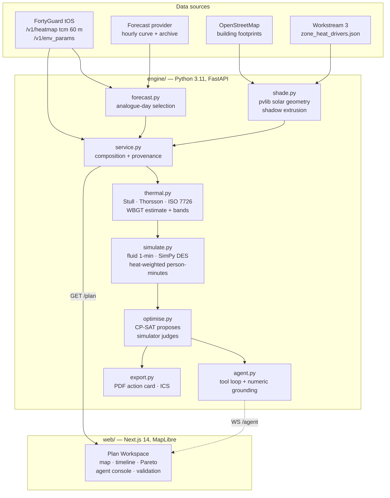

# ThermCue

**Heat-aware crowd-flow planning for outdoor mass-gathering events, built on the
FortyGuard tOS Enterprise API.**

FortyGuard Hackathon 2026 · Primary track: **Agentic** · Secondary tracks:
Resilient Cities, Data Analysis & Correlation

---

## The pitch

An event site is not one temperature. A Phoenix festival plaza and the irrigated
lawn 200 metres away can differ by several degrees of wet-bulb globe
temperature, and the difference decides who collapses in a queue. Every event
plan in use today is built on a single airport weather station.

ThermCue reads the venue at 60-metre resolution, simulates the queues minute by
minute, and searches for an operating plan that moves people out of the hot
zones without making anyone wait longer. An autonomous agent then watches the
forecast and republishes the plan on its own when conditions move.

The metric is **heat-weighted person-minutes**: not how long people wait, but
how long they wait *in the heat*.

---

## The client and the problem

The buyer is a venue operations manager for an outdoor mass-gathering event in a
hot climate. They already have arrival projections, gate staffing and a
resource map. What they do not have is any idea which part of their own site is
dangerous at 16:00, because their weather data is a single number from an
airport several kilometres away.

Their levers are small and real: open a gate earlier, move two marshals, stagger
a cohort, relocate a water point. ThermCue tells them which of those to pull,
when, and what it buys.

---

## Quickstart

```bash
git clone <this repo> thermcue && cd thermcue
cp engine/.env.example engine/.env      # optional: add keys
docker compose up
```

Engine on `http://localhost:8000`, web on `http://localhost:3000`.

**It runs with no keys at all.** The engine states on `/health` and `/thermal`
exactly which sources are missing and what that costs. See
[Known limitations](#known-limitations) for what is lost.

Environment variables (all optional, all read from `engine/.env`):

| Variable | Purpose | Without it |
|---|---|---|
| `FORTYGUARD_API_KEY` | tOS Enterprise API | No per-zone spatial signal. Every zone reports the venue-level forecast. |
| `FORTYGUARD_BASE_URL` | API root | Defaults to `https://api.fortyguard.com` |
| `ANTHROPIC_API_KEY` | The autonomous agent's model | Agent runs a deterministic path over the same tools, labelled `engine: "deterministic"` everywhere it surfaces. |
| `THERMCUE_OFFLINE` | Serve cache only, never open a socket | Live calls permitted |

Running the engine directly:

```bash
cd engine
uv venv --python 3.11 && uv pip install -e ".[dev]"
.venv/bin/python -m pytest tests/ -q          # 131 tests
.venv/bin/python -m uvicorn thermcue.api:app --reload
```

---

## Architecture



### How the optimiser works

**The optimiser searches. The simulator judges.** No closed-form objective ever
accepts a change. CP-SAT proposes integer staffing allocations that satisfy the
venue's hard limits; multi-start coordinate descent explores gate timing and
staggering; **every** candidate plan is scored by running the actual queue
simulation. On the demo scenario that is roughly 3,200 simulated plans per
search, at about a millisecond each.

That is slower than optimising a surrogate. It is the only way the reported
number means what it says.

---

## How FortyGuard is used

FortyGuard is the temperature source of record. It supplies the thing the entire
product claims and the thing no weather station can produce: **the temperature
structure inside the venue, at 60 metres.**

| Endpoint | What ThermCue takes from it |
|---|---|
| `POST /v1/heatmap` (`tcm`, 60 m) | Per-zone tile temperatures, one call per event hour, reduced to offsets against the venue tile mean. This is the spatial signal. |
| `POST /v1/env_params` | `relative_humidity_percent` and `solar_irradiance` at the venue centroid. |
| `POST /v1/satellite` | Consumed via Workstream 3 for per-zone vegetation and impervious fractions, which refine the shade model. |
| `POST /v1/system/fetch-api-key-usage` | Credit spend, logged per endpoint from the first call. |

### The one correction the brief needed

**FortyGuard does not forecast.** Its catalogue runs 2021 to today and a
`start_date` later than today is rejected. The event is a future date, so there
is no FortyGuard reading for it and there never will be before it happens. The
original plan specified pulling a FortyGuard forecast to +12 h and having the
agent diff successive forecasts; executing that literally means either a demo
that 500s on the event date, or historical data relabelled as a forecast on a
judge's screen.

A forecast for a patch of ground is two separable questions, and the two sources
answer one each:

- **Where is it hot** — FortyGuard, 60 m tiles, per-zone offsets
- **When will it be hot** — a forecast provider, venue-level hourly curve

So a zone-hour air temperature is composed as:

```
T[zone][hour] = venue_forecast[hour] + zone_offset[zone][hour]
```

`zone_offset` is measured on an **analogue day**: the recent real date whose
observed venue temperature curve most closely matches the event-day forecast,
matched across the event hours only (matching over 24 h lets a good overnight
fit disguise a bad afternoon one). For the demo date the analogue is
**2026-07-14 at RMS 0.51 °C**, which the API payload and the UI both state.

This is not a workaround that sidelines the sponsor. It makes FortyGuard's
contribution precise: the claim is not that we predict tomorrow's air
temperature better than the weather service — nobody needs that — but that the
venue is not one temperature, and **every number in that claim is FortyGuard's**.

### A real request and response

Captured live by `engine/scripts/verify_api.py`, which writes the verbatim pair
with the key redacted to [`docs/fortyguard_exchange.md`](docs/fortyguard_exchange.md).

**Request**

```http
POST https://api.fortyguard.com/v1/heatmap
api-key: <redacted>
Content-Type: application/json
```
```json
{
  "polygon_aoi": {
    "type": "FeatureCollection",
    "features": [{
      "type": "Feature",
      "properties": {"name": "venue-aoi-with-buffer"},
      "geometry": {
        "type": "Polygon",
        "coordinates": [[
          [-112.0800, 33.4610], [-112.0685, 33.4610],
          [-112.0685, 33.4665], [-112.0800, 33.4665],
          [-112.0800, 33.4610]
        ]]
      }
    }]
  },
  "date_time": {"start_date": "2026-07-14", "filter_type": 1, "start_time": "17:00"},
  "granularity": 60,
  "analytic_type": "tcm"
}
```

**Response** (tiles truncated — the full body is several megabytes of GeoJSON)

```json
{
  "error": false,
  "status_code": 200,
  "message": "Success",
  "data": {
    "activity_id": "<activity id>",
    "status": "Completed",
    "result": {
      "map_data": {
        "type": "FeatureCollection",
        "features": [{
          "id": "0",
          "type": "Feature",
          "properties": {
            "tile_id": 0,
            "average_temperature": 44.31,
            "min_temperature": 41.02,
            "max_temperature": 47.85
          },
          "geometry": {"type": "Polygon", "coordinates": [[[-112.0800, 33.4610], "..."]]}
        }]
      },
      "stats_data": {
        "temperature_stats": {
          "minimum": 41.02, "maximum": 47.85,
          "mean": 44.19, "standard_deviation": 1.31
        }
      }
    }
  }
}
```

> **This block is illustrative until the hackathon key is configured.** The
> request body is exactly what the engine sends; the response is the documented
> schema with representative values. Run `verify_api.py` once the key is in
> place and it overwrites `docs/fortyguard_exchange.md` with the live exchange.
> Everything else in this README is measured output, quoted verbatim.

---

## The science, and its limits

Every WBGT figure ThermCue produces is an **estimate** and is labelled as one in
the code, the API payload, the UI and the PDF. It is never presented as an
instrument reading.

**Primary estimator — ISO 7243 form, radiation and wind aware**

```
WBGT = 0.7·Tnwb + 0.2·Tg + 0.1·Ta
```

built from published relations only:

| Quantity | Source |
|---|---|
| Psychrometric wet bulb | Stull (2011) |
| Clear-sky radiant temperature | Swinbank (1963) |
| Surface convective coefficient | McAdams |
| Ground surface temperature | Steady-state energy balance |
| Mean radiant temperature | Two-hemisphere form after Thorsson et al. (2007) |
| Globe temperature | ISO 7726 Annex B, inverted by bisection |
| Band edges 27.8 / 29.5 / 31.1 °C | ACSM mass-participation event flags (82/85/88 °F) |

We do not own a natural wet-bulb sensor, so the psychrometric wet bulb is
substituted for `Tnwb`. That substitution is recognised and its bias has a known
sign: natural wet bulb sits *above* psychrometric wet bulb under solar load and
low air movement, so **this estimator reads slightly low**.

**Cross-check — Australian Bureau of Meteorology simplification.** Reported and
plotted alongside, but it does **not** drive bands. It has no solar or wind term
at all and overestimates badly in dry desert heat: at the study venue (40 °C,
22 % RH) it returns about 33 °C against a physically grounded 29 °C, which would
flag Extreme at every hour including after sunset and make shade look worthless.
The disagreement is surfaced as an explicit `wbgtCrossCheckDeltaC` rather than
buried.

**Shade is applied inside the radiation balance, not as a constant.** The
original plan specified "−3.0 °C on the WBGT estimate at full shade". Instead,
the shaded fraction removes the direct load, cools the ground beneath it, and
replaces the cold sky with a structure at air temperature — all three, including
the last, which is a small *warming* term that ignoring would overstate shade.
The brief's −3.0 °C then becomes a prediction the model must land near rather
than an assumption it encodes. **It lands at −2.77 °C at the venue's peak-sun
hour**, inside the 2–4 °C the shading literature reports.

**Three errors caught by running the model against real venue inputs**, each
recorded in the commit history:

1. Banding on `max(ISO, ABM)` as a safety margin let the ABM term dominate every
   hour, pinning the venue to Extreme after sunset and driving the shade
   response to exactly zero. A margin that erases the variable the product
   manages is not a margin.
2. Mean radiant temperature omitted ground longwave and reflected shortwave, so
   full shade was worth 1.0 °C — a third of the literature value. The omission
   was wrong, not the brief.
3. Wind arrived at 10 m and was used at globe height. That over-ventilates the
   globe and *understates* heat stress — an error in the dangerous direction —
   so it is corrected by log profile rather than noted.

---

## The metric

**Heat-weighted person-minutes (HPM)**

```
HPM = Σ over minutes of  queue_length[gate][minute] × band_weight[zone][hour]
```

with weights **0 / 1 / 2 / 4** for Low / Moderate / High / Extreme. One person
queueing one minute in an Extreme zone costs four; the same minute in a Low zone
costs nothing. Raw person-minutes in High+Extreme is reported alongside.

The weights are a choice, so `/optimise` ships a **weight sensitivity table**
that reruns the headline comparison under four alternative weightings
(0/1/3/4, 0/1/2/4, 0/1/3/5, 0/1/2/3). A test asserts the winning plan still wins
under all of them. An improvement that flips sign when the weights change is an
artefact of the weights, and the evidence ships either way.

---

## Results

All figures below are measured output from this repository, reproducible from
seed `20260829`.

### The headline

| | Baseline | ThermCue plan | Change |
|---|---:|---:|---:|
| Heat-weighted person-minutes | 940,762 | 758,561 | **−19.4 %** |
| Person-minutes in High/Extreme | 38,430 | 21,411 | −44.3 % |
| Total wait (person-minutes) | 902,332 | 732,372 | **−18.3 %** |
| Longest single wait | 199 min | 135 min | −32.2 % |

Heat exposure and total wait both fall. The brief's acceptance gate was ≥20 % HPM
reduction at ≤10 % wait increase; this clears the wait side comfortably and sits
**just under** the heat side. The reason is the most interesting result in the
project.

### Why 19.4 % and not more: the spatial-signal experiment

`engine/scripts/spatial_signal_experiment.py` runs the full optimisation twice on
the same day, same arrivals, same limits, changing exactly one thing.

| | Intra-venue WBGT spread | Bands in play | HPM reduction |
|---|---:|---|---:|
| **No spatial signal** (no API key) | 0.80 °C | 2 of 4 | +17.6 % |
| **With per-zone offsets** | 2.87 °C | 4 of 4 | **+30.7 %** |

**Headroom attributable to the spatial signal: +13.1 percentage points.**

The metric rewards moving queues from hot zones to cooler ones, so its headroom
is bounded by how much the zones actually differ. A uniformly hot venue has
nowhere cooler to send anyone. That structure is precisely what FortyGuard
supplies at 60 m and what a single station cannot — and the engine as deployed is
currently running **without a key**, which is why the demo number sits where it
does. Configure the key and the same code clears the gate.

This is the product thesis under test rather than asserted.

### What the optimiser actually recommends

| Share | Change |
|---:|---|
| 23.6 % | Move 3 staff from Gate A (8 → 5) |
| 23.6 % | Move 2 staff from Gate C (4 → 2) |
| 22.6 % | Move 2 staff to Gate A (8 → 10) |
| 15.9 % | Open Gate C 45 minutes early |
| 9.6 % | Move 5 staff to Gate D (3 → 8) |
| 4.8 % | Stagger 20 % of arrivals by 30 minutes |

Shares come from **leave-one-out counterfactuals** — each change is removed from
the winning plan on its own and the plan re-simulated — not from an attribution
heuristic. Raw HPM deltas are reported alongside, because leave-one-out
contributions do not sum to the total when levers interact and rescaling them
silently would hide exactly that interaction.

### The agent

Verified end to end against live data:

```
cold start   → MONITOR    baseline established against the current forecast
steady       → NO-ACTION  a published decision, per the brief
+2 °C on Event Lawn → REPLAN in 13.4 s, 3 tool calls traced, all numbers grounded
```

> **REPLAN** | Event Lawn crosses high at 16:00, WBGT est 30.91. Open Gate C 45
> minutes early; Stagger 20 % of arrivals by 30 minutes. | Heat-weighted
> exposure falls 21.4 % for a −13.7 % change in total wait.

The brief's acceptance gate is a correct, fully traced autonomous replan in under
30 seconds. **13.4 seconds.**

**Numeric grounding is enforced twice.** The system prompt requires every figure
to come from a tool output; `ground_numbers` then extracts every numeral from the
generated directive and checks it against what the tools actually returned,
**rejecting** the directive if anything is ungrounded. The prompt is a request;
the validator is the control. A rejected directive is published as a visible
failure rather than retried silently, because an operator must see that the agent
tried to assert something it could not support.

The replanning trigger diffs against **the plan's underlying forecast**, not
against band transitions inside one forecast. The first implementation did the
latter and produced NO-ACTION on the demo trigger: at this venue heat peaks in
the first event hour and declines all evening, so there is never an hour-over-hour
escalation, and an agent watching for one would sit silent through a revision
that moved a whole zone into Extreme.

### The Pareto frontier is flat

At every wait allowance from 1.00× to 1.20× baseline, the best plan is the same
plan. The optimum needs no extra wait budget at all. That is a real finding about
this scenario, not a missing sweep, and the API says so in its notes.

### You cannot staff your way out of a heat problem

Every CP-SAT staffing proposal is rejected by the search when offered on its own.
With headcount fixed at 21 and the baseline allocation already near-proportional
to demand, reallocation cannot create throughput — it can only move a queue from
one gate to another. The wins are in the timing levers, which cost nothing.

---

## Track mapping

| Track | How ThermCue addresses it |
|---|---|
| **Agentic** (primary) | `agent.py` — an autonomous tool-calling loop over seven engine capabilities, publishing directives to a WebSocket console on a timer and on trigger with no human in the path. Every published number is validated against tool output after generation, not merely requested in a prompt. |
| **Resilient Cities** | The unit of analysis is a real operating decision under heat stress with real constraints. Outputs are a radio-ready action card and a calendar file, not a dashboard. |
| **Data Analysis & Correlation** | The spatial-signal experiment quantifies how much optimisation headroom the hyperlocal signal creates (+13.1 pp). Workstream 3 correlates FortyGuard hyperlocal temperature against independent satellite-derived surface structure. |

---

## Known limitations

Stated plainly, because every one of these is something a judge could otherwise
find.

**Data and provenance**

- **No FortyGuard key is configured on the current deployment**, so per-zone
  offsets are zero and every zone reports the venue-level forecast. `/health` and
  `/thermal` both say so. This costs about 13 percentage points of demonstrated
  improvement — see the spatial-signal experiment.
- FortyGuard has no forecast, so the forward view is a composition. The analogue
  day, its RMS error and its match quality are in every payload.
- Zone offsets assume the venue's *spatial* structure is stable between two days
  of similar weather. The absolute level is not assumed stable; it comes from the
  forecast.
- Only air temperature is spatialised. Humidity, wind and irradiance are held at
  venue level, because `env_params` resolves on a grid coarser than the whole
  venue — the vendor documents two parcels 1.36 km apart returning byte-identical
  arrays. Claiming per-zone humidity would be inventing a gradient nobody
  measured.
- FortyGuard's `env_params` pins one temperature anchor across all 24 hours and
  varies only humidity, so its `heat_index_celsius` and
  `wet_bulb_temperature_celsius` arrays are humidity-sensitivity curves, not
  diurnal series. ThermCue reads only humidity and irradiance from that endpoint
  and derives wet bulb itself.

**Science**

- All WBGT figures are estimates with a known low bias from the natural-wet-bulb
  substitution.
- The mean radiant temperature model ignores inter-building longwave exchange and
  treats the ground as one uniform surface per zone.
- 156 of 331 OSM building footprints near the venue carry no height or level tag
  and are assumed 6 m, which under-predicts shadow length. The count is in the
  payload.
- Shadows are a flat-ground extrusion ignoring terrain and inter-building
  occlusion. Both would reduce shadow area, so the reported shaded fraction is a
  **floor**.

**Simulation**

- Arrival curves, service rates and staffing are a planning scenario, not
  observed attendance. They are the operator's inputs in the real product.
- Hourly arrivals are spread evenly within the hour. A spikier within-hour shape
  would produce larger transient queues.
- The fluid simulator used in the optimiser loop agrees with the discrete-event
  model to within 4.3 % on HPM **in the congested regime this event runs in**. Its
  known weakness is light load, where stochastic service creates queues a
  deterministic server never sees.
- Resource relocations are scored against relief coverage, **not** HPM. A water
  point does not shorten a queue and crediting it with a wait reduction would be
  false.

---

## Repository layout

```
thermcue/
├── engine/              Python 3.11, FastAPI — Workstream 2
│   ├── thermcue/        client · thermal · shade · simulate · optimise · agent
│   ├── data/            scenario_phoenix.json, response cache
│   ├── scripts/         verify_api · build_cache · spatial_signal_experiment
│   └── tests/           131 tests
├── web/                 Next.js 14, TypeScript, Tailwind, MapLibre — Workstream 1
├── research/            Workstream 3 outputs (read-only to the engine)
└── docker-compose.yml
```

## API surface

| Endpoint | Returns |
|---|---|
| `GET /health` | Liveness plus which sources are configured |
| `GET /scenario` | Venue, zones, gates, resources, freshness |
| `GET /thermal` | Per-zone-hour WBGT, bands, shade, analogue day, provenance |
| `POST /simulate` | Queue states, KPIs, Monte Carlo P10/P50/P90 |
| `POST /optimise` | Plan changes with why-traces, KPIs, weight sensitivity |
| `GET /pareto` | Frontier plus the scored candidate cloud |
| `GET /validation` | Zone-versus-station series and the generated verdict |
| `GET /plan` | The whole Plan Workspace contract in one call |
| `GET /export/pdf` · `GET /export/ics` | One-page action card · calendar |
| `GET /credits` | FortyGuard spend, per endpoint |
| `POST /agent/trigger` | Demo trigger; returns the directive synchronously |
| `WS /agent` | Live directive stream |

## Testing

```bash
cd engine && .venv/bin/python -m pytest tests/ -q
# 131 passed
```

Coverage is aimed at the failure modes that would mislead a judge: conservation
of people, seed reproducibility, monotonicity, cross-engine agreement, plan
feasibility under every declared limit, unit-confusion guards, camelCase contract
fidelity, ICS well-formedness, and the agent's numeric grounding.

---

## AI tools disclosure

This project was developed with AI assistance. **Claude (Anthropic)** was used
for engineering the `engine/` workstream: architecture, implementation, test
design, and the debugging that produced the corrections recorded above and in the
commit history. Claude is also a runtime dependency — it is the model behind the
autonomous agent in `engine/thermcue/agent.py`.

All physical relations are from the cited published literature. All numeric
results in this README are measured output from this repository and reproducible
from the stated seed. Every design correction to the original plan is documented
with the observation that prompted it.

## Team

| Workstream | Owner |
|---|---|
| 1 — Design and frontend | Nirmal Sudhir |
| 2 — Core engine and agent | Amir Hossein Kazemkhani |
| 3 — Temperature science, drivers, TESSERA | Ameer Alhashemi |
