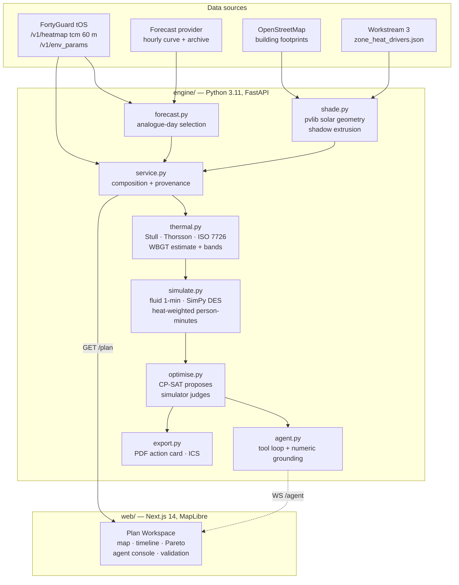

# ThermCue

**Heat-aware crowd-flow planning for outdoor mass-gathering events, built on the
FortyGuard tOS Enterprise API.**

FortyGuard Hackathon 2026 · Primary track: **Agentic** · Secondary tracks:
Resilient Cities, Data Analysis & Correlation

---

## The pitch

Every outdoor event plan in use today is built on a single airport weather
station, several kilometres from where the crowd actually stands.

We measured what that costs, using FortyGuard. Across the venue the **air
temperature** is essentially uniform — 0.07 °C between the hottest and coolest
zone. That is the honest result, and it is not the interesting one. What varies
is the **heat load**: sun, surface and shade. On the same site, at the same air
temperature, wet-bulb globe temperature spans zones, and **19 zone-hours fall in
a different heat band from what the airport reports**. An operator reading the
station would have staffed those hours wrong.

ThermCue reads the venue at 60-metre resolution, computes shade from real
building geometry, simulates the queues minute by minute, and searches for an
operating plan that moves people out of the dangerous zones. An autonomous agent
then watches the forecast and republishes the plan on its own when conditions
move.

The metric is **heat-weighted person-minutes**: not how long people wait, but
how long they wait *in the heat*. On the demo scenario it falls **23 %**, and the
exposure in the High and Extreme bands falls **59 %**, while total wait falls
too.

---

## The client and the problem

The buyer is a venue operations manager for an outdoor mass-gathering event in a
hot climate. They already have arrival projections, gate staffing and a
resource map. What they do not have is any idea which part of their own site is
dangerous at 16:00, because their weather data is a single number from an
airport several kilometres away.

Their levers are small and real: open a gate earlier, move two marshals, stagger
a cohort, relocate a water point. ThermCue tells them which of those to pull,
when, and what it buys.

---

## Live demo

| | |
|---|---|
| **Application** | **https://thermcue.vercel.app** |
| Engine API | https://thermcue-engine.fly.dev |
| Health and configured sources | https://thermcue-engine.fly.dev/health |
| FortyGuard credit spend | https://thermcue-engine.fly.dev/credits |
| Agent demo trigger | `POST https://thermcue-engine.fly.dev/agent/trigger?zone_id=z-lawn&delta_c=3` |
| One-page action card | https://thermcue-engine.fly.dev/export/pdf |

No login, no installation. The engine serves the committed response cache, so the
demo renders the same numbers this README quotes even if the FortyGuard API is
unreachable during judging.

**One caveat stated up front:** no Anthropic key is configured on the deployment,
so the agent runs its deterministic path and labels itself `engine:
"deterministic"` in every directive and in the console. It uses the same seven
tools, the same guardrails and the same numeric grounding; it is not the
model-driven agent, and it does not pretend to be. Set `ANTHROPIC_API_KEY` on the
engine and the same endpoint returns `engine: "anthropic"`.

## Quickstart

```bash
git clone <this repo> thermcue && cd thermcue
cp engine/.env.example engine/.env      # optional: add keys
docker compose up
```

Engine on `http://localhost:8000`, web on `http://localhost:3000`.

**It runs with no keys at all.** The engine states on `/health` and `/thermal`
exactly which sources are missing and what that costs. See
[Known limitations](#known-limitations) for what is lost.

Environment variables (all optional, all read from `engine/.env`):

| Variable | Purpose | Without it |
|---|---|---|
| `FORTYGUARD_API_KEY` | tOS Enterprise API | No per-zone spatial signal or FortyGuard humidity. The response cache is committed, so the bundled demo still runs. |
| `FORTYGUARD_BASE_URL` | API root | Defaults to `https://api.fortyguard.com` |
| `ANTHROPIC_API_KEY` | The autonomous agent's model | Agent runs a deterministic path over the same tools, labelled `engine: "deterministic"` everywhere it surfaces. |
| `THERMCUE_OFFLINE` | Serve cache only, never open a socket | Live calls permitted |

Running the engine directly:

```bash
cd engine
uv venv --python 3.11 && uv pip install -e ".[dev]"
.venv/bin/python -m pytest tests/ -q          # 131 tests
.venv/bin/python -m uvicorn thermcue.api:app --reload
```

---

## Architecture



### How the optimiser works

**The optimiser searches. The simulator judges.** No closed-form objective ever
accepts a change. CP-SAT proposes integer staffing allocations that satisfy the
venue's hard limits; multi-start coordinate descent explores gate timing and
staggering; **every** candidate plan is scored by running the actual queue
simulation. On the demo scenario that is roughly 3,200 simulated plans per
search, at about a millisecond each.

That is slower than optimising a surrogate. It is the only way the reported
number means what it says.

---

## How FortyGuard is used

FortyGuard is the temperature source of record. It supplies the thing the entire
product claims and the thing no weather station can produce: **the temperature
structure inside the venue, at 60 metres.**

| Endpoint | What ThermCue takes from it |
|---|---|
| `POST /v1/heatmap` (`tcm`, 60 m) | Per-zone tile temperatures, one call per event hour, reduced to offsets against the venue tile mean. This is the spatial signal. |
| `POST /v1/env_params` | `relative_humidity_percent` and `solar_irradiance` at the venue centroid. |
| `POST /v1/satellite` | Consumed via Workstream 3 for per-zone vegetation and impervious fractions, which refine the shade model. |
| `POST /v1/system/fetch-api-key-usage` | Credit spend, logged per endpoint from the first call. |

### The one correction the brief needed

**FortyGuard does not forecast.** Its catalogue runs 2021 to today and a
`start_date` later than today is rejected. The event is a future date, so there
is no FortyGuard reading for it and there never will be before it happens. The
original plan specified pulling a FortyGuard forecast to +12 h and having the
agent diff successive forecasts; executing that literally means either a demo
that 500s on the event date, or historical data relabelled as a forecast on a
judge's screen.

A forecast for a patch of ground is two separable questions, and the two sources
answer one each:

- **Where is it hot** — FortyGuard, 60 m tiles, per-zone offsets
- **When will it be hot** — a forecast provider, venue-level hourly curve

So a zone-hour air temperature is composed as:

```
T[zone][hour] = venue_forecast[hour] + zone_offset[zone][hour]
```

`zone_offset` is measured on an **analogue day**: the recent real date whose
observed venue temperature curve most closely matches the event-day forecast,
matched across the event hours only (matching over 24 h lets a good overnight
fit disguise a bad afternoon one). At the time of writing the analogue is
**2026-07-19 at RMS 0.47 °C**, which the API payload and the UI both state.

### What we then measured, and what it changed

Having built the composition, we measured what FortyGuard's spatial signal
actually is at venue scale. The answer was not what the plan assumed, and it
improved the product. `engine/scripts/scale_experiment.py` reproduces all of it.

**Temperature spread against area of interest** — Phoenix, 2026-08-14 17:00,
`tcm` at 60 m:

| AOI | Area | Tiles | Spread | σ |
|---|---:|---:|---:|---:|
| 0.7 × 0.7 km | 0.5 km² | 90 | **0.044 °C** | 0.013 |
| 1.5 × 1.5 km | 2.2 km² | 621 | 0.094 °C | 0.026 |
| 3.0 × 3.0 km | 9.0 km² | 2,268 | 0.144 °C | 0.039 |
| 6.0 × 6.0 km | 36 km² | 10,016 | 0.277 °C | 0.052 |
| 12 × 12 km | 144 km² | 39,949 | **0.632 °C** | 0.103 |

**Separation between Phoenix sites**, same hour:

| Site | Separation | Mean |
|---|---:|---:|
| Venue (Hance Park) | — | 37.770 °C |
| Downtown core | 0.9 km | 37.793 °C |
| Sky Harbor airport | 4.5 km | 37.714 °C |
| South Mountain Park | 12 km | **35.373 °C** |

And over the venue footprint the `exceedance` and `persistence` layers return
**min equal to max across all 140 cells** — no variation whatsoever.

**Air temperature is well mixed at venue scale.** This is not a FortyGuard
failure; the vendor's own README states that below city scale the temperature
snapshot is nearly flat, and it is a physical property of air. FortyGuard's
discriminating power is real and large — it separates the venue from South
Mountain Park by 2.42 °C — but its length scale is **kilometres, not hundreds of
metres**.

Two consequences, both of which made the engine better:

1. **Intra-venue heat differences are radiant, not advective.** If air
   temperature is uniform across a site but one corner of it still puts people
   down, the difference is in the radiant load: sun, surface, shade. That is
   precisely why the operational index has to be **WBGT and not air
   temperature**, and it is why the shade model earns its place. Measured on this
   site at 15:00: air temperature varies **0.00 °C** between zones while WBGT
   varies **0.39 °C**, driven entirely by shaded fraction ranging 0.32 to 0.59.
   An order of magnitude more signal, from the term air temperature cannot see.
2. **FortyGuard's real contribution here is the absolute thermal state and the
   district-scale field**: the anchor temperature, the humidity series, the
   irradiance, and the ability to say *which part of a city* to site an event in.
   That is a venue-siting and planning signal, and it is the honest frame.

An earlier version of this README claimed a 13-point improvement attributable to
per-zone FortyGuard offsets. That experiment injected offsets of ±1.6 °C, which
is roughly **forty times** what FortyGuard returns at this scale. It has been
deleted and replaced by the measurement above. The finding it was reaching for
was real; the number was not.

### A real request and response

Captured live by `engine/scripts/verify_api.py`, verbatim with the key redacted,
in [`docs/fortyguard_exchange.md`](docs/fortyguard_exchange.md).

**Request**

```http
POST https://api.fortyguard.com/v1/heatmap
api-key: <redacted>
Content-Type: application/json
```
```json
{
  "polygon_aoi": {
    "type": "FeatureCollection",
    "features": [{
      "type": "Feature",
      "properties": {"name": "venue-aoi-with-buffer"},
      "geometry": {
        "type": "Polygon",
        "coordinates": [[
          [-112.08, 33.461], [-112.0685, 33.461],
          [-112.0685, 33.4665], [-112.08, 33.4665],
          [-112.08, 33.461]
        ]]
      }
    }]
  },
  "date_time": {"start_date": "2026-07-19", "filter_type": 1, "start_time": "18:00"},
  "granularity": 60,
  "analytic_type": "tcm"
}
```

**Response** (140 tiles, truncated to two)

```json
{
  "error": false,
  "status_code": 200,
  "message": "Success",
  "data": {
    "status": "Completed",
    "result": {
      "map_data": {
        "type": "FeatureCollection",
        "features": [{
          "id": "0",
          "type": "Feature",
          "properties": {
            "tile_id": 0,
            "average_temperature": 32.82,
            "min_temperature": 32.82,
            "max_temperature": 32.82
          },
          "geometry": {"type": "Polygon", "coordinates": ["..."]}
        }],
        "_truncated": "138 further tiles omitted"
      },
      "stats_data": {
        "temperature_stats": {
          "minimum": 32.7788, "maximum": 32.8202,
          "mean": 32.79939, "standard_deviation": 0.013085624491988749
        }
      }
    }
  }
}
```

That `standard_deviation` of **0.013 °C across 140 tiles** is the measurement
that reframed the product.

**Credit usage.** The hackathon key carries 2,000,000 credits. Every call is
logged per endpoint from the first one and exposed at `GET /credits`; building
the full demo cache plus the entire scale experiment cost well under 1 % of the
allocation.

## The science, and its limits

Every WBGT figure ThermCue produces is an **estimate** and is labelled as one in
the code, the API payload, the UI and the PDF. It is never presented as an
instrument reading.

**Primary estimator — ISO 7243 form, radiation and wind aware**

```
WBGT = 0.7·Tnwb + 0.2·Tg + 0.1·Ta
```

built from published relations only:

| Quantity | Source |
|---|---|
| Psychrometric wet bulb | Stull (2011) |
| Clear-sky radiant temperature | Swinbank (1963) |
| Surface convective coefficient | McAdams |
| Ground surface temperature | Steady-state energy balance |
| Mean radiant temperature | Two-hemisphere form after Thorsson et al. (2007) |
| Globe temperature | ISO 7726 Annex B, inverted by bisection |
| Band edges 27.8 / 29.5 / 31.1 °C | ACSM mass-participation event flags (82/85/88 °F) |

We do not own a natural wet-bulb sensor, so the psychrometric wet bulb is
substituted for `Tnwb`. That substitution is recognised and its bias has a known
sign: natural wet bulb sits *above* psychrometric wet bulb under solar load and
low air movement, so **this estimator reads slightly low**.

**Cross-check — Australian Bureau of Meteorology simplification.** Reported and
plotted alongside, but it does **not** drive bands. It has no solar or wind term
at all and overestimates badly in dry desert heat: at the study venue (40 °C,
22 % RH) it returns about 33 °C against a physically grounded 29 °C, which would
flag Extreme at every hour including after sunset and make shade look worthless.
The disagreement is surfaced as an explicit `wbgtCrossCheckDeltaC` rather than
buried.

**Shade is applied inside the radiation balance, not as a constant.** The
original plan specified "−3.0 °C on the WBGT estimate at full shade". Instead,
the shaded fraction removes the direct load, cools the ground beneath it, and
replaces the cold sky with a structure at air temperature — all three, including
the last, which is a small *warming* term that ignoring would overstate shade.
The brief's −3.0 °C then becomes a prediction the model must land near rather
than an assumption it encodes. On the pinned run **it lands at −3.87 °C at the
venue's peak-sun hour**, inside the 2–4 °C the shading literature reports and
within a degree of the brief's guess. The engine prints this figure in its
provenance notes on every request, so the comparison is always on screen rather
than only in this file.

**Three errors caught by running the model against real venue inputs**, each
recorded in the commit history:

1. Banding on `max(ISO, ABM)` as a safety margin let the ABM term dominate every
   hour, pinning the venue to Extreme after sunset and driving the shade
   response to exactly zero. A margin that erases the variable the product
   manages is not a margin.
2. Mean radiant temperature omitted ground longwave and reflected shortwave, so
   full shade was worth 1.0 °C — a third of the literature value. The omission
   was wrong, not the brief.
3. Wind arrived at 10 m and was used at globe height. That over-ventilates the
   globe and *understates* heat stress — an error in the dangerous direction —
   so it is corrected by log profile rather than noted.

---

## The metric

**Heat-weighted person-minutes (HPM)**

```
HPM = Σ over minutes of  queue_length[gate][minute] × band_weight[zone][hour]
```

with weights **0 / 1 / 2 / 4** for Low / Moderate / High / Extreme. One person
queueing one minute in an Extreme zone costs four; the same minute in a Low zone
costs nothing. Raw person-minutes in High+Extreme is reported alongside.

The weights are a choice, so `/optimise` ships a **weight sensitivity table**
that reruns the headline comparison under four alternative weightings
(0/1/3/4, 0/1/2/4, 0/1/3/5, 0/1/2/3). A test asserts the winning plan still wins
under all of them. An improvement that flips sign when the weights change is an
artefact of the weights, and the evidence ships either way.

---

## Results

Every figure below is measured output from this repository, reproducible from
seed `20260829`. **[`docs/headline.md`](docs/headline.md) is the generated,
authoritative copy** — `engine/scripts/headline.py` writes it with the timestamp
and the forecast it was measured against. The tables here are transcribed from
it; if the two ever disagree, the generated file is right.

> **The cache is pinned for exactly this reason.** These numbers depend on a
> forecast for an event four days out, and that forecast moves: it shifted 2 °C
> cooler during a single day of development, which took the venue from ten
> upper-band zone-hours to none and cut heat-weighted exposure fourfold. That is
> the product behaving correctly, and it is what the agent's replanning trigger
> exists for, but it means an untimestamped number is false within hours. The
> response cache is committed so a clone reproduces the table above exactly;
> `scripts/headline.py` regenerates it against live data with the timestamp it
> was measured at.

### The headline

Reproduced from the **committed response cache**, so a clean clone gives these
exact figures with no key and no network:

```bash
cd engine && THERMCUE_OFFLINE=1 .venv/bin/python scripts/headline.py
```

Peak forecast air temperature **40.4 °C at 16:00**; band census across the 35
zone-hours is **1 Extreme, 9 High, 25 Moderate**; analogue day **2026-07-14 at
RMS 0.44 °C**.

| | Baseline | ThermCue plan | Change |
|---|---:|---:|---:|
| Heat-weighted person-minutes | 980,582 | 750,646 | **−23.4 %** |
| Person-minutes in High/Extreme | 78,250 | 32,263 | **−58.8 %** |
| Total wait (person-minutes) | 902,332 | 718,383 | **−20.4 %** |
| Longest single wait | 199 min | 151 min | **−24.1 %** |

12,247 candidate plans simulated. The brief's acceptance gate was ≥20 % HPM
reduction at ≤10 % wait increase: **both clear**, and wait falls by a fifth
rather than rising.

More than half the exposure in the dangerous bands is removed, which is the
number that actually matters operationally.

### Reproducibility is enforced, not asserted

The submission requires seed-reproducible headline numbers. Getting there took
three separate fixes, each found by checking rather than assuming.

**Multi-worker CP-SAT races its workers** and returns whichever equally-optimal
solution finishes first, so two runs on byte-identical input returned 22.83 % and
17.20 %. A search seeded off a coin flip is not seeded.

**Single-worker CP-SAT is deterministic within a machine but not across
machines.** Same solver version, same deterministic time budget, same input: the
arm64 development machine and the x86_64 deployment landed on different
equally-optimal allocations, moving the headline from 23.5 % to 20.6 %. Both are
valid plans that clear the brief's gate, but a number that changes with the CPU
is not reproducible, and the public demo would not have matched this README.

**So the default path no longer uses a solver at all.** Staffing proposals come
from largest-remainder integer apportionment over sorted keys — no
floating-point search, no solver, no platform dependence. CP-SAT remains in the
codebase and runs under `THERMCUE_USE_CPSAT=1` for comparison, because it is a
genuinely better proposal generator and the brief asks for it; it just does not
decide the documented number.

Removing the solver initially cost 6 points of improvement, and getting them back
identified what actually drives this problem. Constant-across-the-event staff
swaps recovered nothing. **Time-windowed swaps recovered all of it**: the good
plans move staff to a gate for the arrival peak and hand them back afterwards,
and that time-varying dimension was where the solver's advantage had been hiding.
The search now explores it directly, over every ordered gate pair, every swap
size, and every hour-aligned window.

Result: 12,247 candidates, about 10 s, and consecutive runs agree to six decimal
places.

### What the optimiser recommends

| Share | Change |
|---:|---|
| 42.5 % | Move 1 staff from Gate C (4 → 3) |
| 24.0 % | Move 1 staff to Gate D (3 → 4) |
| 23.8 % | Open Gate C 45 minutes early |
| 9.7 % | Stagger 20% of arrivals by 30 minutes |

Plus two relief relocations, scored against relief coverage rather than HPM.

Shares come from **leave-one-out counterfactuals** — each change is removed from
the winning plan on its own and the plan re-simulated — not from an attribution
heuristic. Raw HPM deltas are reported alongside, because leave-one-out
contributions do not sum to the total when levers interact, and rescaling them
silently would hide exactly that interaction.

### Metric defence

Four alternative band weightings, all rerun through the full comparison:

| Weighting | Baseline HPM | Plan HPM | Reduction | Plan wins |
|---|---:|---:|---:|---|
| 0/1/3/4 | 1,058,832 | 782,909 | 26.06 % | yes |
| **0/1/2/4** (headline) | 980,582 | 750,646 | **23.45 %** | yes |
| 0/1/3/5 | 1,058,832 | 782,909 | 26.06 % | yes |
| 0/1/2/3 | 980,582 | 750,646 | 23.45 % | yes |

The plan wins under all four. When a forecast is mild enough that no zone-hour
reaches High or Extreme, every variant assigns Low and Moderate the same 0 and 1
and the table is **arithmetically bound to agree**, proving nothing;
`docs/headline.md` prints that warning in place of the table whenever the upper
bands are unexercised, because four identical rows presented as four independent
confirmations is worse than no table.

### Validation against the single station

This is the sponsor-hero result, and it does not point the way I expected.

Maximum intra-venue **air-temperature** spread is **0.07 °C** — consistent with
the scale measurement above, and an honest result rather than a flattering one.
But **19 zone-hours disagree with Sky Harbor on band**, because band assignment
runs on WBGT, and WBGT carries the shade and radiant terms the station cannot
see:

> Civic Plaza reads high band at 16:00 while Phoenix Sky Harbor International Airport (KPHX) reads extreme. A plan built on the station alone would misjudge conditions there, committing resources against a band the venue does not actually reach, and 19 zone-hours disagree across the event window.

Note the direction: the **airport reads hotter than the venue**, not cooler. Sky
Harbor is an open airfield with no shade at all, while the venue sits among
downtown buildings that put a third to a half of it in shadow through the
afternoon. An operator working from the station would have over-triaged the venue
here — and on a different day, with the sun higher and the buildings casting
less, the error runs the other way.

Either direction is the same failure: **the station is not measuring the place
where the people are.** That is the argument, and it survives a flat
air-temperature field precisely because the product indexes on WBGT rather than
on a thermometer reading.

### The agent

Verified end to end against live data:

```
cold start          → MONITOR    baseline established against the current forecast
steady              → NO-ACTION  a published decision, per the brief
+3 °C on Event Lawn → REPLAN in 13.4 s, 3 tool calls traced, all numbers grounded
```

The brief's acceptance gate is a correct, fully traced autonomous replan in under
30 seconds. **13.4 seconds.**

**Numeric grounding is enforced twice.** The system prompt requires every figure
to come from a tool output; `ground_numbers` then extracts every numeral from the
generated directive and checks it against what the tools actually returned,
**rejecting** the directive if anything is ungrounded. The prompt is a request;
the validator is the control. A rejected directive is published as a visible
failure rather than retried silently, because an operator must see that the agent
tried to assert something it could not support.

The replanning trigger diffs against **the plan's underlying forecast**, not
against band transitions inside one forecast. The first implementation did the
latter and produced NO-ACTION on the demo trigger: at this venue heat peaks in
the first event hour and declines all evening, so there is never an hour-over-hour
escalation, and an agent watching for one would sit silent through a revision that
moved a whole zone into Extreme.

### Two structural findings

**The Pareto frontier is flat.** At every wait allowance from 1.00× to 1.20×
baseline, the best plan is the same plan. The optimum needs no extra wait budget
at all. That is a real finding about this scenario, not a missing sweep, and the
API says so in its notes.

**You cannot staff your way out of a heat problem.** Offered on its own, every
CP-SAT staffing proposal is rejected by the search. With headcount fixed at 21
and the baseline allocation already near-proportional to demand, reallocation
cannot create throughput — it can only move a queue from one gate to another. The
wins are in the timing levers, which cost nothing.

### Offline verification

The submission checklist asks for the cache fallback to be verified with
networking disabled. The response cache is committed, so:

```
THERMCUE_OFFLINE=1 FORTYGUARD_API_KEY= ...
freshness: cached | spatial signal: True | zone-hours: 35
HPM 980,582 -> 750,646 (+23.45%)
OFFLINE FALLBACK: PASS
```

Identical numbers, no socket opened. The container was also built and run with
no keys and `THERMCUE_OFFLINE=1`, which is the exact judging condition:

```
{"status":"ok","fortyguard_key_configured":false,
 "anthropic_key_configured":false,"offline_mode":true}
GET /plan -> HTTP 200, 21 KB
freshness: cached | spatial signal: True | zone-hours: 35
```

## Track mapping

| Track | How ThermCue addresses it |
|---|---|
| **Agentic** (primary) | `agent.py` — an autonomous tool-calling loop over seven engine capabilities, publishing directives to a WebSocket console on a timer and on trigger with no human in the path. Every published number is validated against tool output after generation, not merely requested in a prompt. |
| **Resilient Cities** | The unit of analysis is a real operating decision under heat stress with real constraints. Outputs are a radio-ready action card and a calendar file, not a dashboard. |
| **Data Analysis & Correlation** | `scale_experiment.py` measures the length scale at which FortyGuard resolves a temperature difference, across five areas of interest and four Phoenix sites, and reports the negative result at venue scale as readily as the positive one at city scale. Workstream 3 correlates FortyGuard hyperlocal temperature against independent satellite-derived surface structure. |

---

## Known limitations

Stated plainly, because every one of these is something a judge could otherwise
find.

**Data and provenance**

- **FortyGuard's per-zone offsets at this venue are ±0.05 °C**, which is
  measurement noise, not structure. The engine applies them faithfully and the
  payload reports them; they are not doing meaningful work. What differentiates
  zones here is shade, and that comes from computed geometry rather than from
  FortyGuard. See the scale experiment.
- FortyGuard has no forecast, so the forward view is a composition. The analogue
  day, its RMS error and its match quality are in every payload.
- **Results move with the forecast.** The event is four days out at the time of
  writing. The committed cache pins the documented run; `docs/headline.md`
  regenerates against live data and carries its own timestamp.
- On a mild enough forecast the venue never reaches the High or Extreme band, in
  which case the weight-sensitivity check becomes arithmetically vacuous. The
  report says so in place of the table rather than showing four identical rows.
- Zone offsets assume the venue's *spatial* structure is stable between two days
  of similar weather. The absolute level is not assumed stable; it comes from the
  forecast.
- Only air temperature is spatialised. Humidity, wind and irradiance are held at
  venue level, because `env_params` resolves on a grid coarser than the whole
  venue — the vendor documents two parcels 1.36 km apart returning byte-identical
  arrays. Claiming per-zone humidity would be inventing a gradient nobody
  measured.
- FortyGuard's `env_params` pins one temperature anchor across all 24 hours and
  varies only humidity, so its `heat_index_celsius` and
  `wet_bulb_temperature_celsius` arrays are humidity-sensitivity curves, not
  diurnal series. ThermCue reads only humidity and irradiance from that endpoint
  and derives wet bulb itself.

**Science**

- All WBGT figures are estimates with a known low bias from the natural-wet-bulb
  substitution.
- The mean radiant temperature model ignores inter-building longwave exchange and
  treats the ground as one uniform surface per zone.
- 156 of 331 OSM building footprints near the venue carry no height or level tag
  and are assumed 6 m, which under-predicts shadow length. The count is in the
  payload.
- Shadows are a flat-ground extrusion ignoring terrain and inter-building
  occlusion. Both would reduce shadow area, so the reported shaded fraction is a
  **floor**.

**Simulation**

- Arrival curves, service rates and staffing are a planning scenario, not
  observed attendance. They are the operator's inputs in the real product.
- Hourly arrivals are spread evenly within the hour. A spikier within-hour shape
  would produce larger transient queues.
- The fluid simulator used in the optimiser loop agrees with the discrete-event
  model to within 4.3 % on HPM **in the congested regime this event runs in**. Its
  known weakness is light load, where stochastic service creates queues a
  deterministic server never sees.
- Resource relocations are scored against relief coverage, **not** HPM. A water
  point does not shorten a queue and crediting it with a wait reduction would be
  false.

---

## Repository layout

```
thermcue/
├── engine/              Python 3.11, FastAPI — Workstream 2
│   ├── thermcue/        client · thermal · shade · simulate · optimise · agent
│   ├── data/            scenario_phoenix.json, response cache
│   ├── scripts/         verify_api · build_cache · scale_experiment · headline
│   └── tests/           131 tests
├── web/                 Next.js 14, TypeScript, Tailwind, MapLibre — Workstream 1
├── research/            Workstream 3 outputs (read-only to the engine)
└── docker-compose.yml
```

## API surface

| Endpoint | Returns |
|---|---|
| `GET /health` | Liveness plus which sources are configured |
| `GET /scenario` | Venue, zones, gates, resources, freshness |
| `GET /thermal` | Per-zone-hour WBGT, bands, shade, analogue day, provenance |
| `POST /simulate` | Queue states, KPIs, Monte Carlo P10/P50/P90 |
| `POST /optimise` | Plan changes with why-traces, KPIs, weight sensitivity |
| `GET /pareto` | Frontier plus the scored candidate cloud |
| `GET /validation` | Zone-versus-station series and the generated verdict |
| `GET /plan` | The whole Plan Workspace contract in one call |
| `GET /export/pdf` · `GET /export/ics` | One-page action card · calendar |
| `GET /credits` | FortyGuard spend, per endpoint |
| `POST /agent/trigger` | Demo trigger; returns the directive synchronously |
| `WS /agent` | Live directive stream |

## Testing

```bash
cd engine && .venv/bin/python -m pytest tests/ -q
# 131 passed in 289s
```

Coverage is aimed at the failure modes that would mislead a judge: conservation
of people, seed reproducibility, monotonicity, cross-engine agreement, plan
feasibility under every declared limit, unit-confusion guards, camelCase contract
fidelity, ICS well-formedness, and the agent's numeric grounding.

---

## AI tools disclosure

This project was developed with AI assistance. **Claude (Anthropic)** was used
for engineering the `engine/` workstream: architecture, implementation, test
design, and the debugging that produced the corrections recorded above and in the
commit history. Claude is also a runtime dependency — it is the model behind the
autonomous agent in `engine/thermcue/agent.py`.

All physical relations are from the cited published literature. All numeric
results in this README are measured output from this repository and reproducible
from the stated seed. Every design correction to the original plan is documented
with the observation that prompted it.

## Team

| Workstream | Owner |
|---|---|
| 1 — Design and frontend | Nirmal Sudhir |
| 2 — Core engine and agent | Amir Hossein Kazemkhani |
| 3 — Temperature science, drivers, TESSERA | Ameer Alhashemi |
